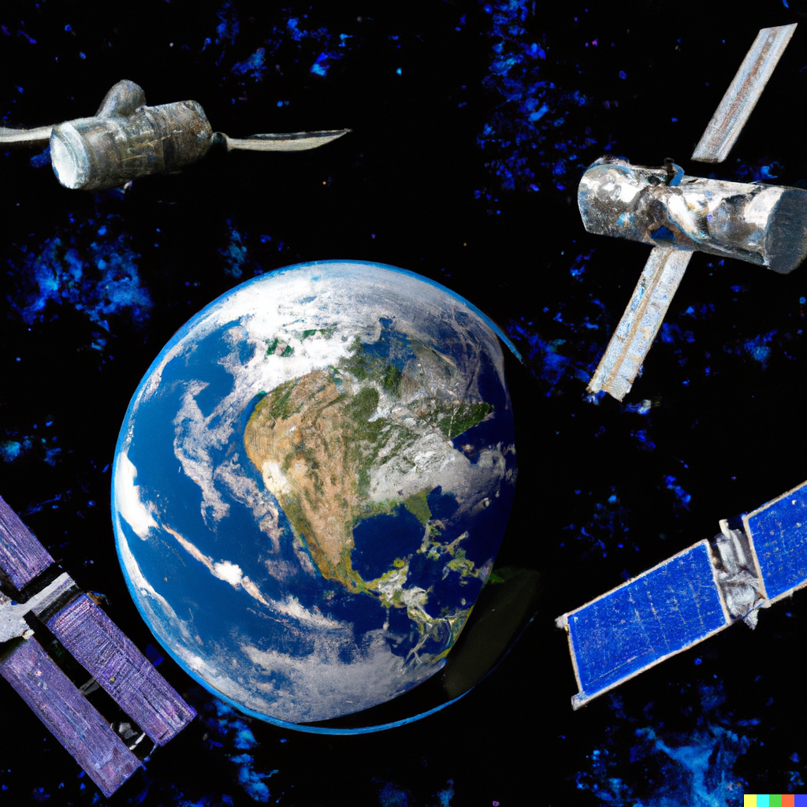

# ORBYTES

Orbital Representation BY Tracking Earth Satellites

___
**ORBYTES provides users the ability to interact with an API interface to extract, visualize, and integrate satellite trajectories actively tracked by space-track.org.**

**In addition to mapping the orbital paths of payloads in regions of Low Earth Orbit (LEO) to Geostationary Orbit (GEO), ORBYTES functions as a platform for users to gain intuition about the beauty and complexity of orbital mechanics.**

**This knowledge is first established through allowing the user to construct their own orbit models by allowing them to simply input uniquely chosen orbital parameters. Practicing the manipulation of certain orbital parameters (such as a satellite's semi-major axis, inclination, or argument of perigee) enhances the users knowledge on which elements <code style = "color : red"> **1) define the physical shape of an orbit**</code> vs <code style = "color : red"> **2) contribute to how an orbit is oriented in space** </code>.**

**This initial experiment provides a basic understanding how orbits are configured around Earth and helps the user visualize the unique orbital planes which correspond to the integrated motion of the satellite along its pre-determined trajectory.**
___
**Throughout this tutorial, the user will:**
* Establish intuition about coordinate transformations within the Earth-Centered Inertial Frame (ECI)
* Learn about the 7 main orbital elements that define the shape, structure, and orientation of an orbit
* Access archives of data on [space-track.org](https://www.space-track.org/) using its Application Programming Interface (API)
* Modify the orbital architecture of orbital shells surrounding Earth to learn about the placement of satellites within larger mega-constellations
* Witness the evolution of the Mean Keplerian Elements of a satellite due to gravitational perturbations from those on adjacent orbital planes
___

This user-friendly package helps gain the neccessary intuition on how contaminated the orbital shells surrounding Earth truly are. After the user estalishes an understanding of how orbital elements function to define a unique orbital trajectory, they are encouraged to model current-epoch satellite data by accessing orbital filings (i.e. two-line element sets which store the orbital elements of individual earth-centered satellites) [space-track.org](https://www.space-track.org/). 

Before one gets to creating interactive orbit models:
1) Register for a **FREE** account on [space-track.org](https://www.space-track.org/). This will allow you access when requesting the API interface to pull data on various constellations of satellites.
2) Once you have logged in, make your way to **HELP $\rightarrow$ API**. Familiarize yourself with how one builds a URL to query data. The class we will be using is called **general perturbations (gp)** and it holds an incredibly efficient and precise keplerian set of orbital parameters for over 26,000 man-made earth-orbiting objects in the form of element sets (ELSETs).
3) [This link](https://www.space-track.org/basicspacedata/modeldef/class/gp/format/html) takes you to a list of all available columns which can be used for filtering and reducing your datasets. The left-most column describes a classification parameter of the satellite (ex. object_type can be either 'PAYLOAD', 'DEBRIS', or 'ROCKET BODY'). The middle column corresponds to the datatype (ex. varchar(24) is a limited-length string with an upper limit of 24 characters).
4) On the same page (**HELP $\rightarrow$ API**), take a look at the REST Operators and REST Predicates. These commands (along with knowledge of column names) will help you construct individual queries when extracting satellite data through API interface. 
